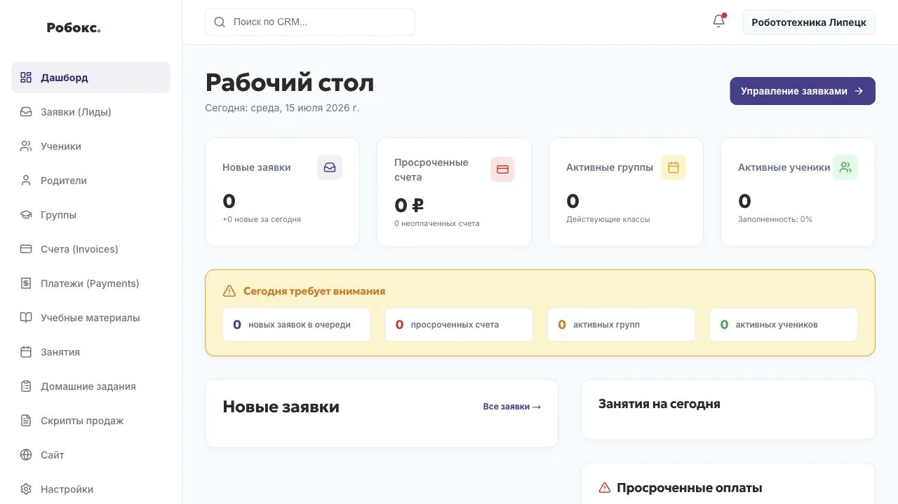
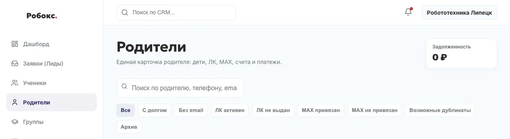
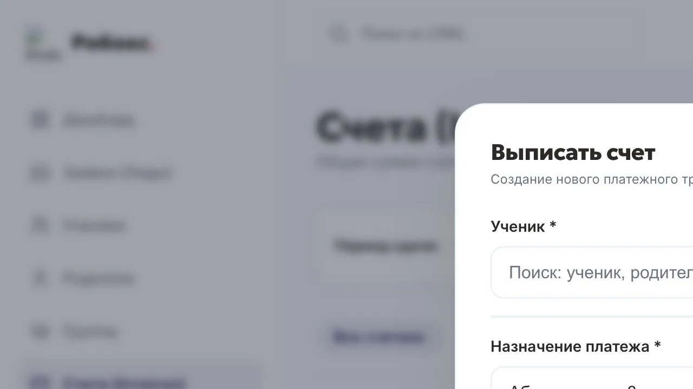
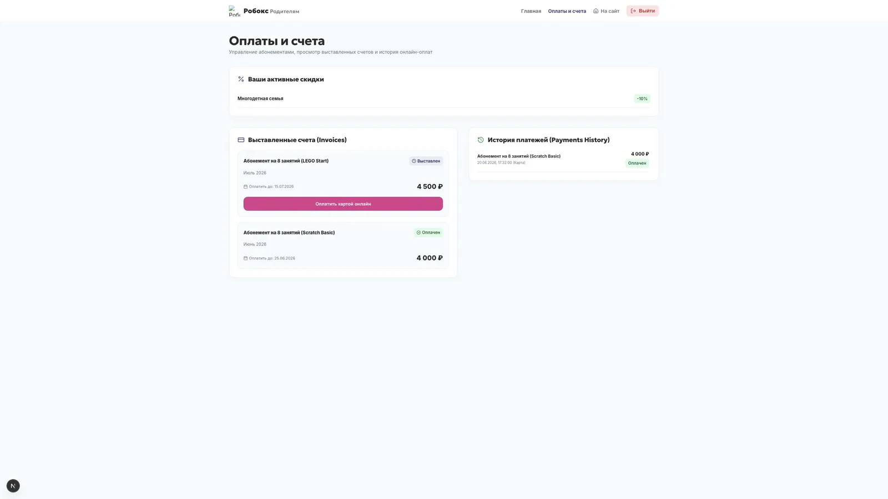
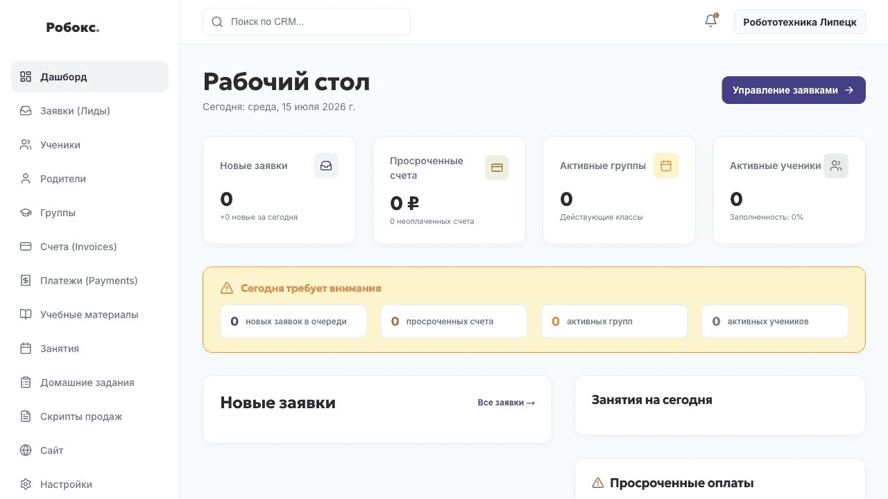

<div align="center">

# EdCRM

### Сайт и CRM для детских образовательных центров

Заявки, ученики, родители, группы, расписание, счета, оплаты и личные кабинеты — в одной системе и под брендом самого центра.

[Первое рабочее внедрение — «Робокс»](https://робокс48.рф)

</div>

---

## О проекте

EdCRM помогает детскому образовательному центру не собирать работу из сайта, таблиц, мессенджеров и отдельных платёжных ссылок.

Главная идея простая: информация проходит через один понятный путь и не теряется между сотрудниками.

```text
заявка с сайта
→ разговор с родителем
→ пробное занятие
→ ученик и родитель в базе
→ подходящая группа
→ счёт
→ оплата
→ личный кабинет родителя
```

Это не просто сайт с административной панелью. В одном проекте объединены публичный сайт центра, рабочее место администратора, учёт учеников и родителей, расписание, платежи и личные кабинеты.

---

## Что уже умеет система

### Для администратора

- принимать заявки с сайта и вести их по воронке;
- создавать учеников и связывать их с одним или несколькими родителями;
- не создавать дубли родителей и безопасно объединять найденные дубли;
- распределять учеников по филиалам, направлениям и группам;
- контролировать вместимость групп;
- вести расписание и посещаемость;
- выставлять счета конкретному родителю;
- учитывать скидки;
- видеть статусы оплат;
- искать учеников, родителей, группы и счета;
- управлять содержимым публичного сайта из CRM.

### Для родителя

- получать счёт в MAX;
- открывать защищённую ссылку на оплату;
- запрашивать у бота текущие счета;
- видеть данные нескольких детей в одном личном кабинете;
- проверять расписание, оплату и доступную информацию об обучении.

### Для руководителя

- работать с несколькими филиалами;
- управлять ролями сотрудников;
- видеть заявки, учеников, группы и финансовые данные в одном месте;
- контролировать, кому выдан доступ в личный кабинет;
- видеть привязку родителя к MAX;
- вести журнал значимых действий.

---

## Как выглядит основной сценарий

1. Родитель оставляет заявку на публичном сайте.
2. Заявка появляется в CRM.
3. Администратор связывается с родителем и назначает пробное занятие.
4. После решения о зачислении создаётся ученик.
5. К ученику привязывается новый или уже существующий родитель.
6. Ученик добавляется в группу.
7. Администратор создаёт счёт и выбирает получателя.
8. Родитель получает сообщение в MAX или ссылку другим способом.
9. Оплата проходит на странице банка.
10. Статус платежа возвращается в CRM.

---

## Основные разделы

- **Заявки** — новые обращения, история общения и статусы.
- **Ученики** — карточки детей, группы, родители и обучение.
- **Родители** — дети, контакты, личный кабинет, MAX, счета и платежи.
- **Группы** — направление, преподаватель, филиал, расписание и свободные места.
- **Счета** — получатель, сумма, скидка, срок и статус.
- **Платежи** — история операций и связь со счетами.
- **Посещаемость** — отметки по проведённым занятиям.
- **Сайт** — управление публичными блоками, курсами, преподавателями и изображениями.
- **Настройки** — организация, филиалы, сотрудники, платежи и внешние сервисы.

---

## Технологии

Проект собран как единый репозиторий с несколькими рабочими пакетами.

### Приложение

- **Next.js 16**
- **React 19**
- **TypeScript**
- **Zod** для проверки входных данных
- собственный набор интерфейсных компонентов

### Данные и доступы

- **PostgreSQL**
- **Supabase**
- серверная авторизация и разграничение ролей;
- политики доступа к данным;
- миграции схемы базы;
- отдельные проверки для сотрудников, родителей и преподавателей.

### Проверка качества

- **Vitest** для модульных и интеграционных тестов;
- **Playwright** для пользовательских сценариев;
- **ESLint**;
- production-сборка Next.js перед выпуском.

### Развёртывание

- **Docker**
- **Docker Compose**
- отдельный production-контейнер приложения;
- локальное или внешнее хранилище медиа;
- отдельная база и окружение для конкретного клиента.

---

## Интеграции

### Альфа-Банк

Система умеет:

- создавать банковский заказ;
- формировать публичную ссылку на оплату;
- проверять статус платежа;
- связывать оплату со счётом;
- хранить техническую историю событий;
- не передавать карточные данные через CRM.

Договор эквайринга и банковские реквизиты принадлежат самому образовательному центру.

### MAX

Бот помогает родителю:

- подтвердить номер телефона;
- связать MAX с карточкой родителя;
- получать новые счета;
- запрашивать командой «Мои счета» активные платежи;
- переходить в личный кабинет.

Один родитель может быть связан сразу с несколькими детьми.

---

## Структура проекта

```text
EdCRM
├── apps/
│   └── web/                 # сайт, CRM, кабинеты и API
├── packages/
│   ├── ui/                  # общие компоненты интерфейса
│   ├── eslint-config/
│   └── tsconfig/
├── supabase/
│   └── migrations/          # история изменений базы данных
├── infra/
│   └── certs/               # публичные сертификаты для внешних API
├── Dockerfile
├── docker-compose.prod.yml
└── package.json
```

---

## Локальный запуск

Понадобятся:

- Node.js 22;
- npm 11;
- доступный проект Supabase или совместимая локальная база;
- заполненный файл окружения.

```bash
npm ci
cp .env.example .env.local
npm run dev
```

После запуска приложение будет доступно по адресу:

```text
http://localhost:3000
```

Никогда не добавляйте реальные ключи, пароли и production-файлы окружения в Git.

---

## Полезные команды

```bash
# запуск разработки
npm run dev

# проверка кода
npm run lint

# тесты
npm run test

# пользовательские сценарии
npm run test:e2e

# production-сборка
npm run build
```

---

## Production-сборка

```bash
docker compose   --env-file .env.production   -f docker-compose.prod.yml   build edcrm-web

docker compose   --env-file .env.production   -f docker-compose.prod.yml   up -d edcrm-web
```

Перед обновлением живой системы необходимо:

1. проверить текущую версию;
2. сделать резервную копию базы и медиа;
3. применить новые миграции;
4. собрать новый образ;
5. проверить сайт, CRM, личный кабинет, платежи и уведомления;
6. сохранить возможность отката.

Подробные команды развёртывания не следует смешивать с этим обзорным файлом. Для них лучше использовать отдельную закрытую инструкцию без секретов.

---

## Ветки

- `develop` — проверка новых изменений;
- `main` — версия для production.

Новые функции сначала проходят тестирование, а затем попадают в `main`.

---

## Состояние проекта

EdCRM уже используется в реальном образовательном центре, но продолжает активно развиваться.

Ближайшие направления:

- автоматические резервные копии и проверка восстановления;
- мониторинг приложения, платежей и фоновых задач;
- дальнейшее разделение крупных модулей;
- удаление настроек, жёстко связанных с первым внедрением;
- повторяемое создание новой организации;
- импорт и экспорт данных;
- усиление сценариев сверки платежей;
- улучшение документации для администратора.

---

## Скриншоты и демонстрация

Материалы записаны в изолированном demo-режиме и содержат только обезличенные тестовые данные.

### Обзор CRM



### Родители



### Счета



### Кабинет родителя



### Сквозной demo-сценарий



GIF показывает путь: заявка → ученик → родитель → группа → счёт → подготовка ссылки для отправки в MAX → оплата в кабинете родителя.

---

## Для кого создаётся EdCRM

В первую очередь — для небольших и средних центров дополнительного образования:

- школ робототехники;
- школ программирования;
- языковых школ;
- развивающих центров;
- творческих и спортивных студий.

Проект особенно полезен, когда сайт живёт отдельно, заявки находятся в мессенджерах, расписание ведётся в таблице, а ссылки на оплату отправляются вручную.

---

## Важно

Репозиторий содержит рабочую основу продукта и историю его первого внедрения. Перед повторным запуском для другого центра необходимо вынести бренд, домен, организацию, платёжные настройки и начальные данные в отдельную конфигурацию.

Реальные персональные данные и секреты никогда не должны попадать:

- в Git;
- в демонстрационную базу;
- в скриншоты;
- в журнал ошибок;
- в сообщения и документацию.

---

<div align="center">

**EdCRM превращает разрозненный путь от заявки до оплаты в один управляемый процесс.**

</div>
